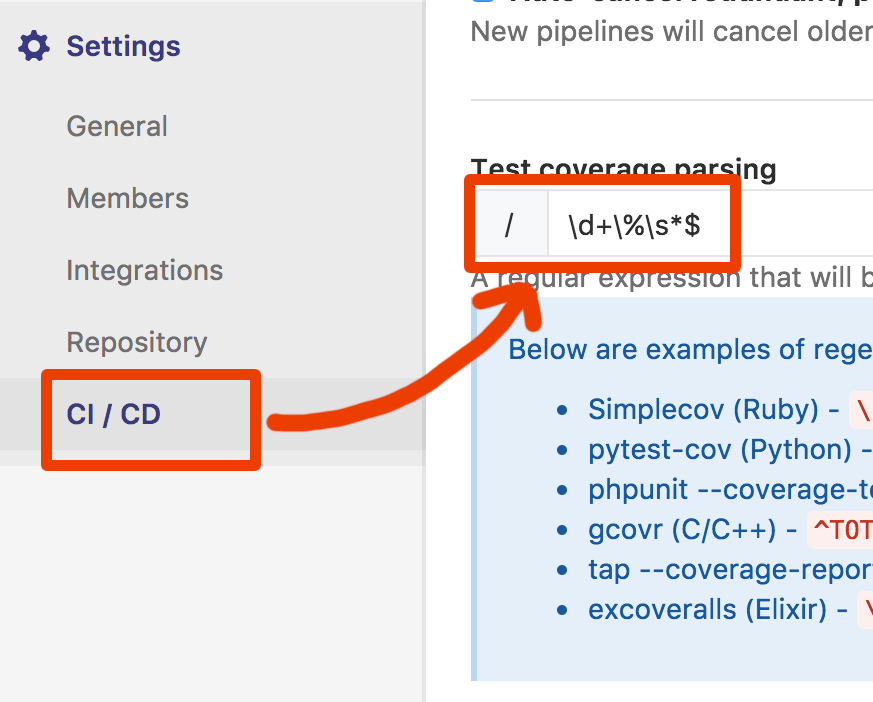

# Delorean python

une implémentation de delorean en python

- PRENOM NOM ELEVE 1, prenom.nom@monmail.com
- PRENOM NOM ELEVE 2, prenom2.nom2@monmail.com

1. Mettre vos noms ci dessus
1. Mettre à jour les liens status avec le numéro de projet
1. Dans les settings du projets, onglet CI/CD entrez la configuration de couverture suivante ``\d+\%\s*$``
 
1. Réaliser les fonctionnalités du [TODOs](#todos)

## liens status ( à mettre à jour )

(remplacer 00 par le numéro du projet pour activer les badges):

[](https://gitlab.iut-blagnac.fr/git_2018/delo-java-00/commits/develop)
[](https://gitlab.iut-blagnac.fr/git_2018/delo-java-00/commits/develop)


## Lancer les tests

```bash
py.test --cov=delorean
```

## Produire un rapport html de la couverture de test

```bash
py.test --cov=delorean --cov-report html
```

## TODOs V1.1.0

### BUG selecteur

- Corriger le bug du selecteur temporel pour que les tests passent

### Ajout lentille gravitationnelle

- ajouter la méthode ``enable_antigravity_lens(self)`` dans la classe ``Delorean``
- ajouter la méthode ``disable_antigravity_lens(self)`` dans la classe ``Delorean``
- ajouter la méthode ``is_flying(self)`` dans la classe ``Delorean`` qui
  renvoie ``True`` quand la lentille est activée.
- ajouter le test ``test_delorean_antigravity()`` dans ``delorean_test.py``

### Amélioration du réacteur en reacteur à déchets

- remplacer la méthode ``insert_plutonium(self)`` par la méthode ``insert_waste(self)`` dans la classe ``Delorean``
- remplacer la méthode ``has_plutonium(self)`` par la méthode ``has_waste(self)`` dans la classe ``Delorean``
- remplacer la méthode ``test_delorean_insert_plutonium()`` par la méthode ``test_delorean_insert_waste(self)`` dans ``delorean_test.py``

### Ajout climatisation

- ajouter la méthode ``set_temperature(self, temperature)`` dans la classe ``Delorean``
- ajouter la méthode ``get_temperature(self)`` dans la classe ``Delorean``
- ajouter le test ``test_delorean_temperature()`` dans ``delorean_test.py``

